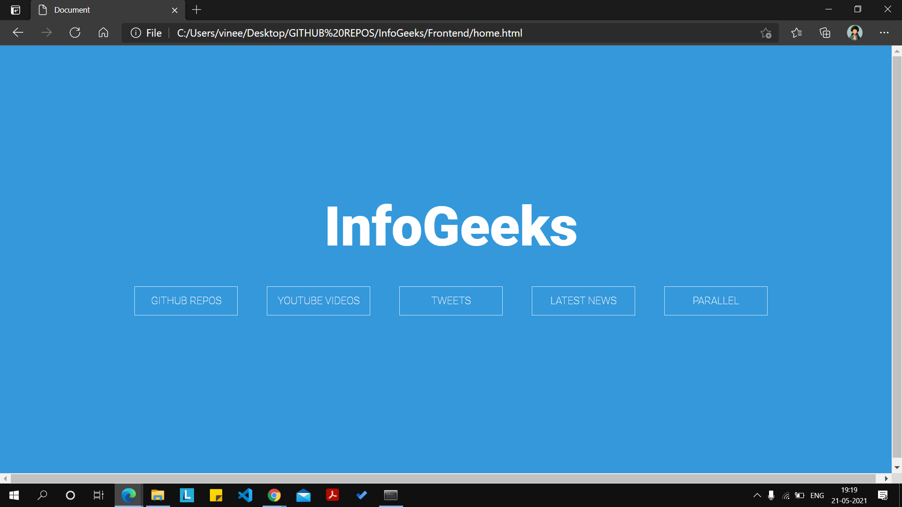
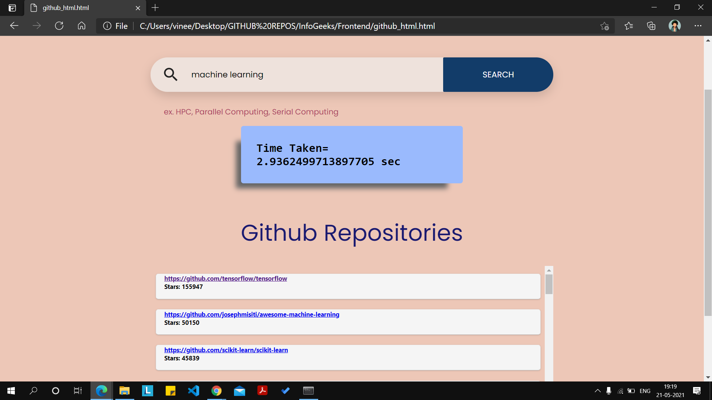
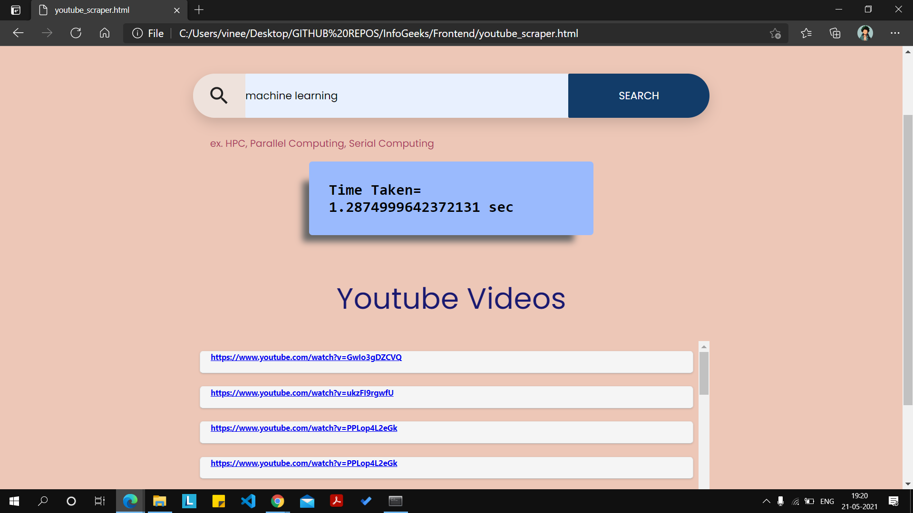
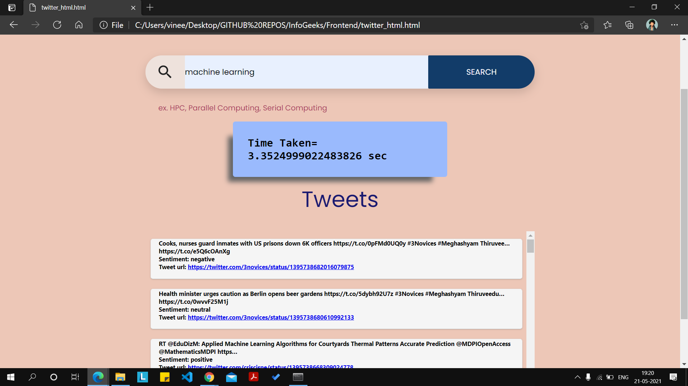
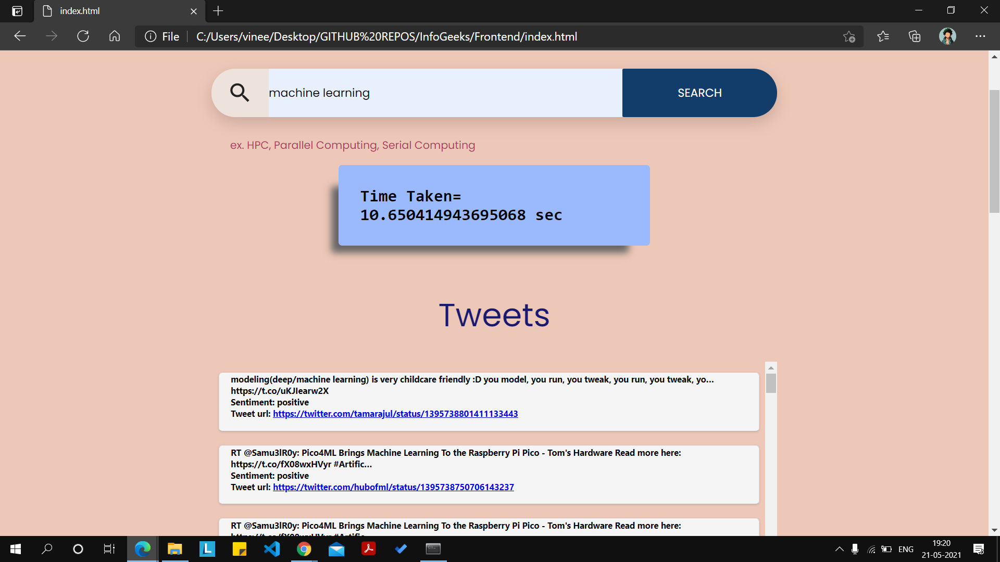

# InfoGeeks
High Performance Computing Semester Project

## Team Name: Info Geeks
## Project Title: InfoStacked
## Team Members:
1. M.Vineeth [E18CSE095]
2. K.Manohar [E18CSE093]
3. Manthan Gupta [E18CSE102]
4. Pulkit Jain [E18CSE136]
5. Samarth Agarwal [E18CSE160]

## Demo Snapshots:

---

---

---

---

---

---

## Abstract:
Gathering useful resources and learning new things every day is an indispensable part of our day-to-day life. With the vast amount of information at our disposal online, occurring in various formats such as articles, videos, research publications etc. Often, it becomes intimidating to deal with such a plethora of sources.
Organizing things is a key to an efficient and holistic approach towards learning. Based on our observations, it is a common fact that people spend most of their time searching for the same topic using various suffix keywords like video, articles, tutorials, projects, etc and bookmarks the useful pages for referencing later.
This leads to a wastage of time since this thing could be done parallelly. Our project focuses on taking the input information and the required categories for which the search results are intended. These queries would then be executed parallelly and the results would be displayed dynamically on the Web Application.
The user would then have the option to customize the output results by performing some elementary operations such as sorting based on relevance, performing deletion, updation, etc. The user could then download the results and store them for future use.
The project aims to showcase the comparative study of the processing time in the serial and parallel execution of the application. Data Scalability would be taken into consideration by varying the number of categories and the capacity of each bucket.
Through this project, we would like to create a Knowledge Management Portal where the primary goal is to automate manual work of searching and spending time in finding useful sources, without wasting our precious time.

## Deliverables:
User input involves the keyword topic to be searched and the various categories to filter the search results.
The number of buckets displayed on the screen would be equal to the number of categories as specified by the user.
The user can put a limit on the number of links to be scrapped in each category, this defines the capacity of the bucket.
The project aims to showcase the comparative study of the processing time in the serial and parallel execution of the application. Data Scalability would be taken into consideration by varying the number of categories and the capacity of each bucket.
The application would visualize the search results and the filling of the buckets in real time. Towards the end, the necessary comparative statistics would be displayed to support the comparative study of the serial and parallel execution of the application.

## HPC Libraries to be used:
OpenMP(Pymp), threading, multiprocessing, joblib

## Datasets and resource links:
https://medium.com/velotio-perspectives/web-scraping-introduction-best-practices-caveats-9cbf4acc8d0f
https://medium.com/prowebscraper/5-best-javascript-web-scraping-libraries-and-tools-71f2459fcfd8 https://www.slideshare.net/vimalsura/parallel-and-distributed-information-retrieval-system https://www.csee.umbc.edu/~nicholas/676/mir2edSlides/slides_chap10.pdf https://www.cs.helsinki.fi/u/hahonen/irm07/lectures/irm07_12.pdf https://ieeexplore.ieee.org/document/651488 https://link.springer.com/chapter/10.1007%2F978-1-4020-3005-5_7 https://serpapi.com/ https://developers.google.com/custom-search/v1/introduction
